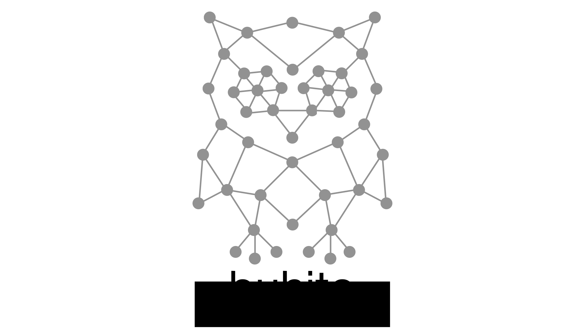

# buhito


**buhito** is a Python library for enumerating graphlets and analyzing graphlet-based features from graphs. 

## Installation

### With pip
```bash
git clone https://github.com/lanl/buhito.git
cd buhito
pip install -e .
```

### With conda
```bash
git clone https://github.com/lanl/buhito.git
cd buhito
```
if creating a new conda environment:
```bash
conda env create -n buhito --file env.yml
```
if installing into an existing conda environment:
```bash
conda env update -n <ENV_NAME> -f env.yml
```
```bash
pip install -e .
```

## Quick Start

### Enumerate graphlets with BFS

```python
import networkx as nx
from buhito import generate_subgraphs_breadthwise

G = nx.petersen_graph()

nx.set_node_attributes(G, {n: "C" for n in G.nodes}, "atom_key")
nx.set_edge_attributes(G, {e: "1" for e in G.edges}, "bond_key")

fp, bitinfo = generate_subgraphs_breadthwise(
    G,
    depth=4,
    return_nodewise=False,
    full_hash=True,
    node_key="atom_key",
    edge_key="bond_key"
)

print("Graphlet fingerprint length:", len(fp))
```

### Enumerate graphlets with DFS

```python
from buhito import generate_subgraphs_depthwise

subsets, counts = generate_subgraphs_depthwise(G, maxlen=4)
print("Found graphlet subsets:", len(subsets))
```

## Examples

Available example scripts:

- `examples/plotting_example.py` — visualize graphlets from the Petersen graph
- `examples/qm9/benchmark_graphlet_featurizers_train_test.py` — benchmark featurizers on QM9 chemical properties data
- `examples/reddit_example/reddit_graphlets_example.py` — network graphlet analysis for REDDIT-5K graphs

## Testing

```bash
pytest tests/
```

## Package structure

- `src/buhito/` — core features
- `src/buhito/converters.py` — converters to NetworkX graphs
- `src/buhito/plotting.py` — graphlet visualization helpers

## Authors

- Yulia Pimonova (LANL)
- Nicholas Lubbers (LANL)
- Nathan Lemons (LANL)
- Pieter Swart (LANL)

## Citation

If you use `buhito` in your work, please cite this repository. A publication citation is coming.

## Copyright and licensing

`buhito` is released under the BSD-3 License. See `LICENSE.txt` for the full license.


The copyright to `buhito` is owned by Triad National Security, LLC
and is released for open source use as project number O5043.


© 2026. Triad National Security, LLC. All rights reserved.
This program was produced under U.S. Government contract 89233218CNA000001 for Los Alamos
National Laboratory (LANL), which is operated by Triad National Security, LLC for the U.S.
Department of Energy/National Nuclear Security Administration. All rights in the program are.
reserved by Triad National Security, LLC, and the U.S. Department of Energy/National Nuclear
Security Administration. The Government is granted for itself and others acting on its behalf a
nonexclusive, paid-up, irrevocable worldwide license in this material to reproduce, prepare.
derivative works, distribute copies to the public, perform publicly and display publicly, and to permit.
others to do so.


